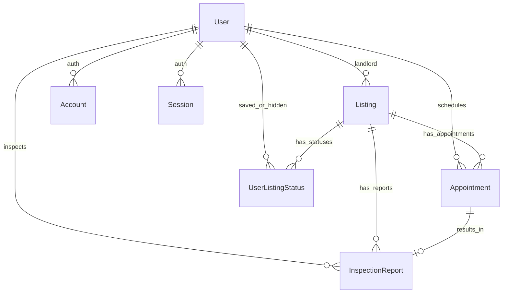

# 🧠 Gemini Developer Instruction & Project Context (GEMINI.md)

歡迎使用 **AI House Rent (智慧租屋管家平台 - Butler)** 開發上下文索引。此檔案旨在協助 AI 助理與開發團隊在最短時間內建立對本專案完整架構、技術細節、資料模型以及開發約定的一致性理解。

---

## 🎯 1. 專案目標與核心理念 (Project Core Goal)

租屋市場長期面臨「資訊不對稱」（如隱瞞漏水、周邊嫌惡設施、高摩擦水電費）與「溝通成本高」的痛點。
本專案的定位為 **「智慧租屋管家」**，藉由 **Gemini AI** 多模態與強大推理能力作為核心驅動引擎：
*   **對話式面試 (Butler Interview)**：以問答形式精準擷取並結構化房客的生活偏好，產生專屬 AI 生活標籤 (`aiTags`)。
*   **零摩擦遷移 (591 Scraper)**：全自動或半自動擷取台灣 591 等外部房源，由 AI 進行結構化解析，免去繁雜的打字登錄流程。
*   **智慧匹配分數 (Match Score)**：完美結合「硬性規則評分」與「AI 語義推理評分」，實現極致精準的個性化房源匹配。
*   **實地物理看房引導 (On-site Inspection Checklist)**：實勘時提供 Checklist 並支援上傳照片，運用 Gemini 多模態視覺分析牆面裂縫、滲漏水或發霉瑕疵，將看房事實轉化為不可竄改的資料結構。

---

## ⚙️ 2. 系統架構與技術棧 (Technology Stack)

*   **全棧框架**：[Next.js 14+](https://nextjs.org/) (採用 App Router 架構) + [React 18+](https://react.dev/)
*   **執行環境**：[Bun](https://bun.sh/)
*   **視覺樣式**：Tailwind CSS + Material 3 Design Guidelines (高質感毛玻璃、8dp 網格與 16dp 圓角，融合極致美學與動態微交互)
*   **資料庫與 ORM**：PostgreSQL + [Prisma ORM](https://www.prisma.io/)
*   **身份驗證**：[NextAuth.js v5](https://authjs.dev/) (Beta) 提供基於 JWT 的角色驗證
*   **雲端圖片儲存**：Google Cloud Storage (GCS) 並搭配 **Signed URL** 安全上傳與下載機制
*   **圖片處理優化**：[Sharp](https://sharp.pixelplumbing.com/) 進行格式與尺寸優化 (WebP 格式、寬高限制 1200px、壓縮品質 80%)
*   **AI 引擎**：[Google AI Studio Gemini API](https://ai.google.dev/)
*   **語系支援**：[next-intl](https://next-intl-docs.vercel.app/) (透過 Middleware 自動處理 `/zh-TW` 等路由語系跳轉)

---

## 🗄️ 3. 資料庫模型 (Database Schema)

專案使用 Prisma 連線 PostgreSQL。核心模型如下 (詳見 [schema.prisma](file:///usr/local/google/home/hanswu/Codes/ai-house-rent/prisma/schema.prisma))：

### 核心 Table 欄位說明

1.  **User (使用者)**：
    *   `role` (`TENANT` | `LANDLORD`)：身分角色，預設為 `TENANT`。
    *   `baseProfile` (`Json`)：基礎資料，如 `{ "phone": string, "occupation": string, "language": string }`。
    *   `aiTags` (`Json`)：對話管家擷取出的生活偏好標籤與預算 `{ "budgetMax": 25000, "regions": ["信義區"], "lifestyleTags": ["有養寵物"] }`。
    *   `trustSummary` (`Text`)：由 AI 分析生成的使用者信用推薦短評。
2.  **Listing (房源)**：
    *   `title` / `price` / `address` / `images` (GCS 路徑陣列) / `lat` / `lng`：基礎欄位。
    *   `features` (`Json`)：硬體特徵，如 `{ elevator: bool, balcony: bool, appliances: string[], atmosphereTags: string[] }`。
    *   `marketTags` (`Json`)：租補助、禮金等標籤。
    *   `sourceUrl` / `rawScrapedData`：外部遷移來源與原始 JSON。
    *   `butlerInsight` (`Json`)：AI 生成之亮點、地雷分析與評分模型。
3.  **InspectionReport (實勘報告)**：
    *   `checklistData` (`Json`)：儲存物理實勘的核對清單。
    *   `photos` (`String[]`)：異常瑕疵之存證照片 GCS 路徑。
    *   `aiSummary` (`Text`)：Gemini 分析現場照片後的實勘總評。
    *   `status` (`String` - 預設為 `"IN_PROGRESS"`)。
4.  **AiConversation / AiMessage (AI 對話快照)**：
    *   追蹤訪談目前的 `currentStep` (引導式問答步驟) 與對話訊息歷史，用以維護持久的對話體驗。

---

## 🤖 4. AI 引擎與 Gemini 函數配置 (AI Engine & Gemini Config)

專案中的 AI 操作統一實作於 [src/lib/ai.ts](file:///usr/local/google/home/hanswu/Codes/ai-house-rent/src/lib/ai.ts)。

### 🚀 模型分配 (Model Allocation)
*   `MODELS.VISION` (`"gemini-2.5-flash-lite"`)：專責多模態影像與截圖辨識，兼顧極致速度與經濟效益。
*   `MODELS.STANDARD` (`"gemini-2.5-flash-lite"`)：專門處理複雜的房源分析、特徵擷取與匹配。
*   `MODELS.LITE` (`"gemini-2.5-flash-lite"`)：專為高頻率對話意圖辨識所搭配。

### 🧠 核心 AI 函式清單

| 函式名稱 | 調用模型 | 功能描述 | 輸入 / 輸出 |
| :--- | :--- | :--- | :--- |
| `parseListingWithAI` | `STANDARD` | 解析 591 的純文字或 Nuxt window 數據，自動結構化為房源屬性 | `(content, locale)` => `Listing JSON` |
| `analyzeListingForExtension` | `STANDARD` | **特工級別分析**。過濾文案中的潛在財務、生活與隱私地雷 | `(content, locale)` => `Verdict & Risks JSON` |
| `diagnoseMatchWithAI` | `STANDARD` | 對比房客的 `aiTags` 與房源特徵，產出相容性分析與 mapping 結果 | `(userTags, listing, locale)` => `Score, Summary & Mapping` |
| `generateInspectionGuideWithAI` | `STANDARD` | 結合房源潛在風險與硬體規格，為房客生成 3~5 點客製化看房 Checklist | `(listing, locale)` => `Checklist items` |
| `analyzeInspectionPhoto` | `VISION` | 多模態視覺分析。辨識實勘照片中的漏水、黴斑或硬體毀損 | `(base64Image, taskName, locale)` => `Text analysis` |
| `extractIntentFromChat` | `LITE` | 從 AI Butler 對話對答歷史中，動態過濾提取出標籤陣列 | `(messages, locale)` => `Tags[]` |
| `parseListingFromImage` | `VISION` | 直接 OCR 房源網頁或 App 截圖，一鍵生成結構化房源資訊 | `(base64Image, locale)` => `Listing JSON` |

---

## 🔌 5. 核心 API 端點與前端元件 (API Routes & Components)

### 📱 前端核心元件：`AIButler.tsx`
*   檔案路徑：[src/components/AIButler.tsx](file:///usr/local/google/home/hanswu/Codes/ai-house-rent/src/components/AIButler.tsx)
*   **狀態機制**：
    *   `MENU`：預設情境。提供地圖情境底下的上下文按鈕（例：房源內頁提供「AI 房源診斷」、新增房源時提供「AI 內文優化」、實勘報告中提供「實地看房清單」）。
    *   `INTERVIEW`：**引導式生活偏好訪談**。由前端 input 連動後端 [/api/ai/interview/next](file:///usr/local/google/home/hanswu/Codes/ai-house-rent/src/app/api/ai/interview/next/route.ts) 以持久化 Session 輪流進行對答。

### 🌐 關鍵 API 端點 (API Routes)

1.  **AI 管家訪談**：
    *   `/api/ai/interview/next`：推動引導式問答，內部調用 [src/lib/services/butler.service.ts](file:///usr/local/google/home/hanswu/Codes/ai-house-rent/src/lib/services/butler.service.ts)，提取偏好並寫入 `User.aiTags`。
    *   `/api/ai/interview/history`：撈取當前 sessionId 的歷史對話對答，維持對話持久性。
2.  **房源與分析**：
    *   `/api/listings` (`GET` / `POST`)：取得所有房源（自動計算對應房客的 `MatchScore` 且幫圖片產生 Signed URL）/ 房東新增房源。
    *   `/api/listings/analyze`：調用 `cheerio` 爬取 591 後，結合 `analyzeListingForExtension` 進行高維度的潛在地雷與合規性分析。
3.  **實勘報告**：
    *   `/api/inspect/analyze`：調用 `analyzeInspectionPhoto` 多模態分析實勘時拍攝上傳的瑕疵圖片。
    *   `/api/inspect/report`：儲存結構化現場 Checklist 與照片 GCS 路徑。

---

## 🛑 6. 開發守則與視覺限制 (Development Rules & Constraints)

> [!IMPORTANT]
> **核心原則 1：現在的狀況都先做「房客」功能。如果遇到/看到「房東」的東西與流程，程式碼絕對不要移除，但視覺上必須先隱藏。**

### 🎨 視覺設計與 premium 美學要求
1.  **嚴禁瀏覽器預設元素**：必須使用質感毛玻璃效果 (`backdrop-blur-xl`)、圓角卡片 (`rounded-[2rem]` 或 `rounded-xl`)，按鈕須提供優雅的 hover 縮放微動畫與陰影。
2.  **專屬調色盤**：
    *   背景色：奶油白 (`#FFFDD0`)
    *   主色：陶土紅 (`#D2691E`)
    *   文字色：深炭灰 (`#333333`)
3.  **排版與字體**：導入 modern premium 級字體 (如 Google Fonts Outfit 或 Inter)；所有微動畫與互動必須有動態響應。
4.  **無預留 Placeholder**：所有圖片或內容必須具備真實演示效果。如需生成 UI 設計或素材，應調用相關工具。

### 🔒 安全與效能約束
*   **GCS 簽署機制**：照片絕不能通過後端中轉上傳，必須從前端請求 Signed URL 後直接 PUT 到 GCS；讀取時一律需後端轉為 Signed Download URL。
*   **速率限制 (Shield)**：AI 運算與 Chat 端點必須結合 `RateLimit` 模型，防範恶意的 API 資源超額消耗。

---

## 🚀 7. 當前待辦與未來路線圖 (Active Backlog & Roadmap)

1.  **座標自動解析**：未來在新增房源時，應結合 Google Geocoding API，將房東輸入的地址轉換為真實 `lat`/`lng` 並儲存，替代目前的隨機渲染。
2.  **照片塗鴉與標註**：擴充看房瑕疵照片分析，讓房客可在畫面上手動圈選裂縫位置，並由 Gemini Flash 針對特定區域重新評估。
3.  **房源連動對話**：對話管家（AI Butler）完成訪談後，應能直接與 Prisma Listing 向量資料庫 (`embedding`) 連動，直接在對話框中為房客推薦前三名高適配度的真實物件。
4.  **隱藏房東視覺入口**：全面檢查 `/landlord` 的視覺呈現與導覽元件，確保 TENANT 登入時所有 landlord 入口皆處於完全隱藏狀態，但保持代碼高度完整。

---
*Powered by Google DeepMind Team & Gemini AI*
