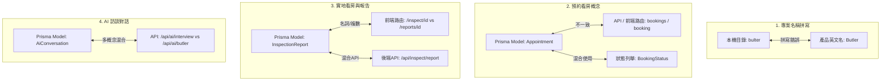

# 🧠 Butler 專案命名一致性分析與對齊報告 (Naming Alignment Report)

本報告旨在系統性盤點當前智慧租屋管家平台（Butler）在目錄名稱、資料庫模型、API 路由與前端頁面設計中存在的命名不一致性，並提供具體的對齊建議與未來重構路線圖。

---

## 📊 1. 核心命名不一致盤點表 (Key Inconsistencies)

目前專案中存在以下 5 大核心概念的命名分歧：

---

## 🔍 2. 詳細不一致分析與影響 (Deep Dive)

### 🔴 A. 專案拼寫不一致 (Folder Spelling Mismatch)
* **現況**：
  * 本機工作區目錄名稱為 `bulter` (L 在 T 前)。
  * 產品核心名稱與代碼邏輯皆為 **`Butler` (管家，T 在 L 前)**，如 `ButlerService`、`AIButler.tsx`。
  * `README.md` 末尾存在 `# bulter` 的拼寫錯誤。
* **影響**：開發者在本機路徑切換與全局搜尋時容易造成拼寫混淆。

### 🔴 B. 預約看房：`Appointment` vs `Booking`
這是代碼層面最顯著的命名衝突：
* **現況**：
  * **資料庫模型**：[`schema.prisma`](file:///usr/local/google/home/hanswu/Codes/bulter/prisma/schema.prisma#L126) 中定義為 `model Appointment`，且 User/Listing 中的關聯欄位皆為 `appointments`。
  * **狀態列舉**：[`schema.prisma`](file:///usr/local/google/home/hanswu/Codes/bulter/prisma/schema.prisma#L118) 中卻使用 `enum BookingStatus`。
  * **後端 API**：[`src/app/api/bookings`](file:///usr/local/google/home/hanswu/Codes/bulter/src/app/api/bookings/route.ts) 使用複數的 `bookings`。
  * **前端路由**：[`src/app/[locale]/listings/[id]/booking`](file:///usr/local/google/home/hanswu/Codes/bulter/src/app/[locale]/listings/[id]/booking/page.tsx) 使用單數的 `booking`。
* **影響**：同一個「預約看房」概念，在後端/資料庫叫 `Appointment`，到了前端/API 卻變成了 `Booking`，增加心智負擔。

### 🟡 C. 實地實勘與報告：`Inspect` vs `Inspection` vs `Report`
* **現況**：
  * **資料庫模型**：[`schema.prisma`](file:///usr/local/google/home/hanswu/Codes/bulter/prisma/schema.prisma#L142) 中命名為 `model InspectionReport`。
  * **前端看房流**：[`src/app/[locale]/inspect/[id]`](file:///usr/local/google/home/hanswu/Codes/bulter/src/app/[locale]/inspect/[id]/page.tsx) 採用動詞 `inspect` (代表「正在進行看房」)。
  * **前端報告頁**：[`src/app/[locale]/reports`](file:///usr/local/google/home/hanswu/Codes/bulter/src/app/[locale]/reports) 採用名詞複數 `reports` (代表「查看已完成的報告」)。
  * **API 端點**：`/api/inspect/report` 與 `/api/ai/inspect` 混用了動名詞。
* **分析**：此命名在 RESTful 概念上可以解釋為「在 `/inspect` (看房流) 完成後，生成並存檔至 `/reports` (報告庫)」，但若能將資料庫、API 與路由的名詞更緊密結合，會更具一致性。

### 🟡 D. AI 偏好訪談：`Butler` vs `Interview` vs `Chat`
* **現況**：
  * **API 端點**：
    * `/api/ai/butler/init`：用於初始化招呼語。
    * `/api/ai/interview/next`：用於引導式生活偏好訪談。
    * `/api/ai/chat`：用於一般的 AI 閒聊。
  * **資料庫模型**：使用 `model AiConversation` 與 `model AiMessage`。
* **分析**：雖然這三者在產品功能上有細微差別（招呼、引導訪談、自由閒聊），但底層都依賴相同的 `AiConversation` 資料庫表。

### 🟢 E. 房東與房客角色殘留：`LANDLORD` 的存在
* **現況**：
  * 專案規範（`guideline.md`）指出：**「本專案完全專注於房客功能，如果見到房東相關的代碼與流程，可以直接進行刪除與清理」**。
  * 但在 `schema.prisma` 的多個 Table (如 `Listing`、`Appointment`) 依然留有 `landlord` 關聯。
* **分析**：這屬於底層架構遺留設計，雖然前端 `/landlord` 相關的頁面入口已隱藏，但資料庫外鍵關聯仍保留以維持資料完整性。

---

## 🚀 3. 命名對齊建議方案 (Alignment Roadmap)

為了在不破壞現有運行中系統（`bun dev` 運行中）的前提下優雅對齊，建議分為三階段進行優化：

### 📍 第一階段：輕量級對齊與文檔修正 (低風險，立即執行)
* [ ] **修正 README 拼寫**：將 `README.md` 末尾的 `# bulter` 修正為 `# Butler`。
* [ ] **代碼內拼寫檢查**：確保所有註解與 UI 顯示中的拼寫皆為 `Butler`。

### 📍 第二階段：API 與前端路由對齊 (中風險，需要同步重構前後端呼叫)
* [ ] **統一「預約」命名為 `Booking`**：
  * 考慮到前端與 API 使用 `booking` 更符合現代 Web App 的預約習慣，可保持 API 與前端路由不變。
  * 將 Prisma Model 的 `Appointment` 重命名為 `Booking`，並同步將關係欄位改為 `bookings`。
  * 修正 schema 中 `Appointment` 的外鍵關聯名稱。
* [ ] **統一「實勘報告」路由與 API**：
  * 將前端 `/inspect/[id]` 改為 `/reports/create/[id]` 或保持分離但將 API 統一整合至 `/api/reports` 內。

### 📍 第三階段：資料庫模型徹底重構 (高風險，需重新 Migration)
* [ ] 將 `AiConversation` / `AiMessage` 底層模型重構對齊為 `ButlerConversation` 或保持現狀但統一服務名稱。
* [ ] 清理 `schema.prisma` 中完全未用到的 `landlord` 欄位（在確定完全不需要房東資料時執行）。

---
> [!TIP]
> 第一階段的修正隨時可以安全進行。第二、三階段因為涉及到資料庫 schema 變更與 Next.js 路由路徑調整，建議在離峰時間或配合資料庫重置（`bun prisma db push --accept-data-loss`）時一併調整。
